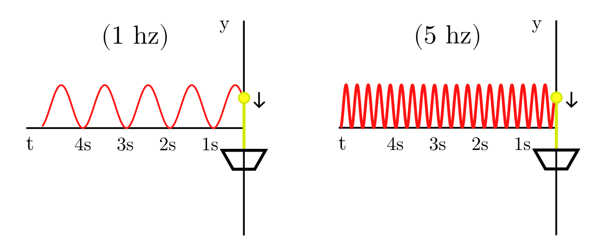

#+TITLE: A Analysis of a Computational Model of a Wave
#+DATE: <2026-04-21 Tue>
#+AUTHOR: Johnny A. Rojas

* How does the wave appear to travel
*The apparatus*
We started with a string that was mounted in  the following way. The string is pass-through by a pulley on the left which is used to hang a mass "T" vertically straight to produce a tension at the left side of the string, keep in mind that this point is unmovable. Then the right side of the string is attached to a point which we can modify its vertical position through time, allows us to send pulses to the string.

*Experimenting with the setup*
After we have build this apparatus we can start to play around with it by changing some of its initial conditions. Lets keep in mind that the result we will get will be related to the generated displacement that occurs in equal time intervals that travel through the string. There are many functions that exhibit a pattern of oscillation (meaning that they follow a repeated pattern, maybe we can even use a modulus function!), but to keep things simple and predictable, we can define the vertical position of the right point to be the sine function.

\begin{equation*}
y = \sin(t)
\end{equation*}
where:
- y is the position of the right point
- t is time  

However this function with respect to time will give us back a result of 1 as a height after $\frac{\pi}{2}$ seconds, which is not very convenient to track. We can be clever by defining the function to be instead:

\begin{equation}
y = 1 - \cos(2 \pi f t)
\end{equation}

Using the cosine function instead of the sine function allows us to make or starting position to math the real apparatus that we have, which starts at y = 0, the $2\pi f$ allows us to set the frequency of the oscillation.

*** Visualization

** Wave Propagation and Reflections
Now that we have modeled the position of our right point we can start analyzing its behavior of the wave after being induced. In our real apparatus our left point is located 95cm from the right point and has a tension of 10 grams.

Since we have defined the y position of the right point, we can start to ask us how will this point will generate the waves across the left side. We can think of the minimum y value, or the bottom of the weight traveling through the left.

